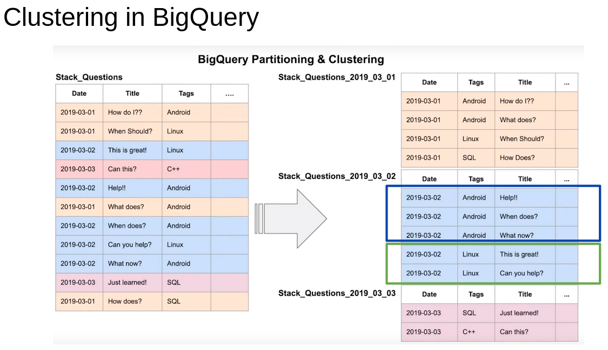

## Module 3 - Data warehouse
A data warehouse is a system that aggregates data from different sources into a single, central and consistent data store to support data analysis. It is used for On Line Analytical Processing (OLAP), which differs from On Line Transactionnal Processing (OLTP), suited for production systems.

### Components of a data warehouse architecture 


source : [IBM/data-warehouse](https://www.ibm.com/topics/data-warehouse)

* **ETL**: It is a process of moving data from the source to the data warehouse ;
* **Metadata**: data giving information about the data into the warehouse ;
* **Staging area**: sometimes, the architecture of a data warehouse includes a staging area, which is a data base for storing raw data from all the sources, during the process of ETL, before loading it into the data warehouse.

### BigQuery
BigQuery is a serverless enterprise data warehouse (meaning there are no servers to manage or database software to install). It offers scalability and high availabity.
It has built in feature like machine learning, geospatial analysis or business intelligence. 

It maximizes flexibility by separating the compute engine that analyzes data from the storage. According to google, common use cases could be :
* Data migrationtion - migrate a data warehouse to BigQuery (from an on prem source or another cloud vendor) ;
* Data transfer into BigQuery from multiple sources ;
* Real-time (event-driven) or Predictive (with built-in AI/ML fetures) analytics.

BigQuery is cost efficient since the pricing is based on compute (analysis), storage and other services like data ingestion or extraction. It is mainly based on two pricing models : 
* On demand pricing ;
* Flat rate pricing (ideal fir managing a huge volume of data).

#### Partitioning in BigQuery
Partitioning can improve BigQuery performance because it reduces the amount of data processed (by going directly into the partition that has the data we need), hence also reducing the cost.


To see the difference, let assume we have uploaded our parquet files of green taxi trip data from 2022 into cloud storage. We can now do the following :

1. create our external table into BigQuery :
```
-- creating an external table from green taxi data of 2022
create or replace external table `drux-de-zoomcamp.ny_taxi.external_green_tripdata_2022`
options (
  format = 'PARQUET',
  uris = ['gs://de-zoomcamp-bucket-drux/green_data_2022/green_tripdata_2022-*.parquet']
);
```

2. create a materialised table from the external table :
```

-- creating the table from the external table
create or replace table `drux-de-zoomcamp.ny_taxi.green_tripdata_2022` as (

  select * from `drux-de-zoomcamp.ny_taxi.external_green_tripdata_2022`

);
```

3. create a partitionned table from the external table :
```
-- create a partitionned table
drop table `drux-de-zoomcamp.ny_taxi.green_tripdata_2022_partitionned` ;

create or replace table `drux-de-zoomcamp.ny_taxi.green_tripdata_2022_partitionned` 
partition by date (lpep_pickup_datetime) as (
  select * from `drux-de-zoomcamp.ny_taxi.external_green_tripdata_2022`
);
```

Now if will write a query that will show us the estimated data processing volume on the partitioned and the non partitioned tables :
```
--- estimating the cost on partitioned vs non partitioned 
select distinct(VendorID)
from `drux-de-zoomcamp.ny_taxi.green_tripdata_2022`
where date(lpep_pickup_datetime) between '2022-05-01' and '2022-06-30'; -- estimated volume of data processed - 12.82 Mb

select distinct(VendorID)
from `drux-de-zoomcamp.ny_taxi.green_tripdata_2022_partitionned`
where date(lpep_pickup_datetime) between '2022-05-01' and '2022-05-30'; -- estimated volume of data processed - 1.14 Mb
```
We can see that the query is ten times faster with partitioned table. 

It is possible to look into the partitions. The following query for example, shows the total number of rows in each partitions :
```
select table_name, partition_id, total_rows
from `ny_taxi.INFORMATION_SCHEMA.PARTITIONS`
where table_name = 'green_tripdata_2022_partitionned'
order by total_rows desc;
```

#### Clustering in BigQuery
when a table is partitioned, another optimisation can be added, which is Clustering. It can be considered a sort of partitioning but applied on text data. That is, BugQuery will group all similar values from a column (the one identified for the cluster) closer together in a partition, to make the query more efficient.


Note that you can cluster on several columns, it is not limited on one column only. If we take our previous example, let's create a clustered table from our external table :
```
-- create a clustered table
drop table `drux-de-zoomcamp.ny_taxi.green_tripdata_2022_clustered` ;

create or replace table `drux-de-zoomcamp.ny_taxi.green_tripdata_2022_clustered` 
partition by date (lpep_pickup_datetime) 
cluster by VendorID as (
  select * from `drux-de-zoomcamp.ny_taxi.external_green_tripdata_2022`
);
```
The dataset in this case is twoo small, so we will not see the difference in clustering the data. But it is efficient for bigger datasets. So note that clustering is not efficient for datasets smaller than 1Gb, and it can even incur additinal costs.


#### Loading data into bigquery
We will have to load the 2022 green data into external table (from parquet format). See homework for the process.