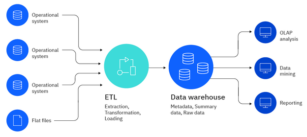
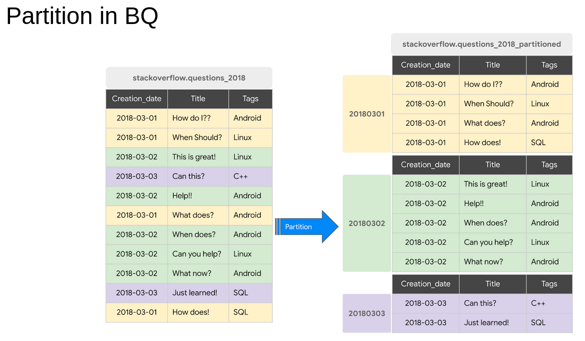

## Module 3 - Data warehouse
A data warehouse is a system that aggregates data from different sources into a single, central and consistent data store to support data analysis. It is used for On Line Analytical Processing (OLAP), which differs from On Line Transactionnal Processing (OLTP), suited for production systems.

### Components of a data warehouse architecture 

source : [IBM/data-warehouse](https://www.ibm.com/topics/data-warehouse)

* **ETL**: It is a process of moving data from the source to the data warehouse ;
* **Metadata**: data giving information about the data into the warehouse ;
* **Staging area**: sometimes, the architecture of a data warehouse includes a staging area, which is a data base for storing raw data from all the sources, during the process of ETL, before loading it into the data warehouse.

### BigQuery
BigQuery is a serverless enterprise data warehouse (meaning there are no servers to manage or database software to install). It offers scalability and high availabity.
It has built in feature like machine learning, geospatial analysis or business intelligence. 

It maximizes flexibility by separating the compute engine that analyzes data from the storage. According to google, common use cases could be :
* Data migrationtion - migrate a data warehouse to BigQuery (from an on prem source or another cloud vendor) ;
* Data transfer into BigQuery from multiple sources ;
* Real-time (event-driven) or Predictive (with built-in AI/ML fetures) analytics.

BigQuery is cost efficient since the pricing is based on compute (analysis), storage and other services like data ingestion or extraction. It is mainly based on two pricing models : 
* On demand pricing ;
* Flat rate pricing (ideal fir managing a huge volume of data).

#### Partitioning in BigQuery
Partitioning can improve BigQuery performance because it reduces the amount of data processed (by going directly into the partition that has the data we need), hence also reducing the cost.

#### Loading data into bigquery
We will have to load the 2022 green data into external table (from parquet format). See homework for the process.