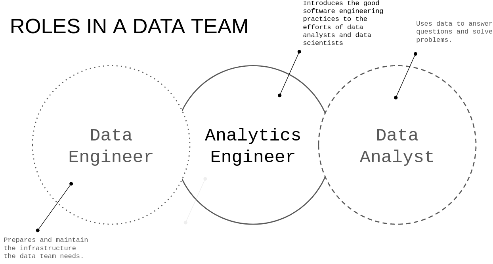
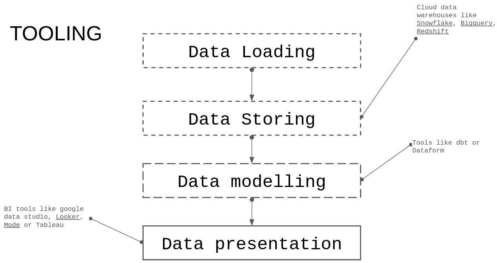
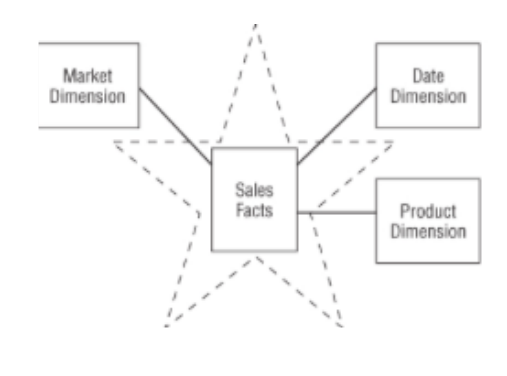
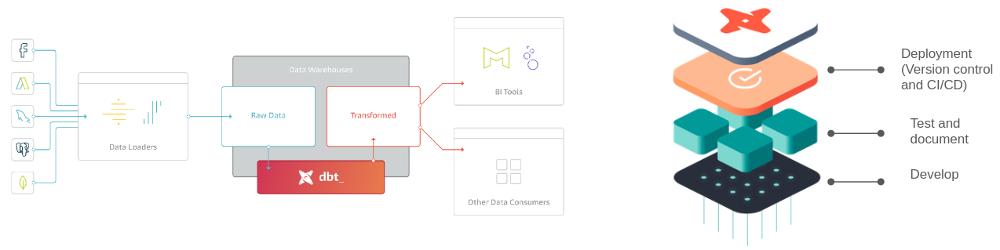
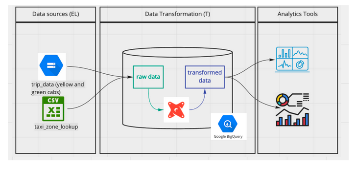

## Module 4 - Analytics Engineering
### Data teams roles
The latest development in the data domain changed the way the data teams were working. There are several role like **data engineers** or **data analysts** (or even the data scientist). There was then a gap between stongly backend oriented profiles like data engineer and strongly business analysis oriented profile as data analyst. Hence the **analytics engineer**, who introduces the good software engineering practices to the efforts of data analysts and data scientists.

### Tooling for an analytics engineer
1. Data Loading tools (fivetran or stitch) ;
2. Data storing tools (cloud or on premisse data warehouses)
3. Data modeling tool (like dbt or Dataform) ;
4. Data presentation (like Looker, Mode or Tableau).

The focus for module 4 is on the last two parts (Data modeling and Data presentation).

### Data modeling
When we talk about data modeling, it mainly refers to analytical data modeling or dimensional modeling (since we model our data for analytical purpos, building fact and dimensions).
There are two main techniques :
* ETL &rarr; Extract, Transform and Load ;
* ELT &rarr; Extract, Load and Transform.

The transformation process is where the modeling happen. It is mainly about creating to types of tables : 
&rarr; **Fact** tables &rarr; that represent a business process or a measurement ;
&rarr; **Dimension** tables &rarr; that correspond to the context of analysis or a business process.

the final schema designed is called a **star schema**.

#### Architecture of dimensional modelling
This architecture can be divided into three main parts :
&rarr; **Staging area**: designed to contain only raw data, it function is to aggregate all the raw data from multiple sources into one point of storage ;
&rarr; **Processing area**: this is where the modeling is happenin ; the raw data is transformed to make sure the standards are met and it can be used efficiently ;
&rarr; **Presentation area**: in this stage, the data is exposed to the final user or business stakeholder.

### What is dbt ?

dbt is a transformation workflow tool that allows to deploy analytics code, using SQL and applying sofware engineering best practices.

#### Architecture for the week

we are going to use BigQuery with no local installation of dbt.
The stack is mainly the following :
* cloud storage &rarr; as data source ;
* dbt &rarr; for data transformation ;
* BigQuery &rarr; as a data warehouse ;
* Loooker &rarr; for data visualisation (in my case, i will use superset instead of looker).
