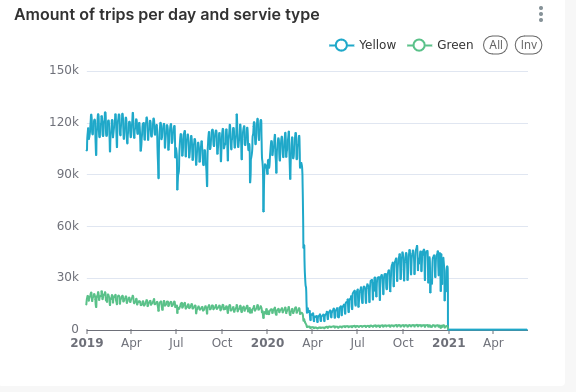
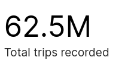
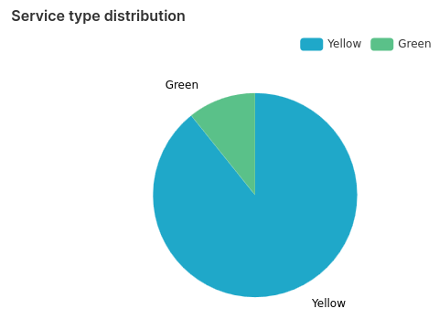
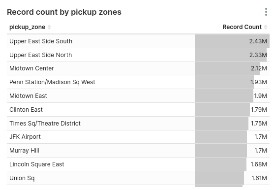
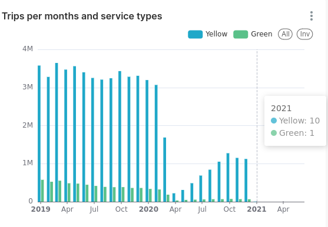

## Visualisation
This part is about creating a dashboard from the data ingested with dbt.

we will try to use superset instead of looker from google.

### Setting up superset
Since we are in dev env, we will just use the docker image to launch superset.

1. download the dockerimage :
```
docker pull apache/superset
```

2. create a secret key:

```
openssl rand -base64 42
```
copy the generated secret key and keep it because we are going to use it later.

3. add bigquery library
The docker image that we pulled contains only the minimal packages needed for testing in dev env. So we will need to add BigQuery manually :

* first we will have to create a docker file
```
touch Dockerfile
```

* file and add our custom in it: 
```
FROM apache/superset
# Switching to root to install the required packages
USER root
# Installing BigQuery dirver to connect to GCP
RUN pip install sqlalchemy-bigquery
# Switching back to using the `superset` user
USER superset
```

* build our custom docker image:
```
docker build -t local/superset . #we add a tag here to specify that the image we will use is different from the one we pulled earlier
```

Now we are ready to launch our image.


4. launch the docker image

```
docker run -d -p 8080:8088 \
-e "SUPERSET_SECRET_KEY=the key generated above" \
--name superset local/superset
```

3. created the admin account
```
docker exec -it superset superset fab create-admin \
--username admin \
--firstname Superset \
--lastname Admin \
--email admin@superset.com \
--password admin
```

4. migrate local db to the latest version 
```
docker exec -it superset superset db upgrade
```

5. load examples (this step is optional) 
```
docker exec -it superset superset load_examples
```

6. setup roles
```
docker exec -it superset superset init
```

and finaly, navigate to http://localhost:8080/login/ and take a look (u/p: [admin/admin])

sources : 
1. [running superset with docker image](https://hub.docker.com/r/apache/superset)
2. [official doc](https://superset.apache.org/docs/intro)

### Creating dashboard 
1. Graph 1 - amount of trips per day and service types




2. Total trips recoded in the period of time




3. Service type distribution




4. Trips per pickup zones



5. Trips per months and service types

