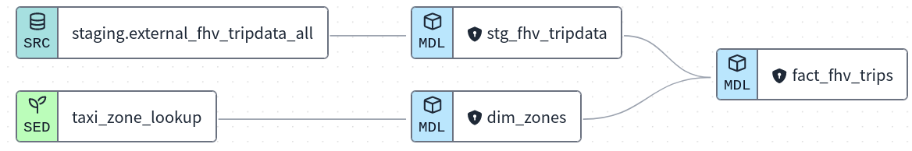
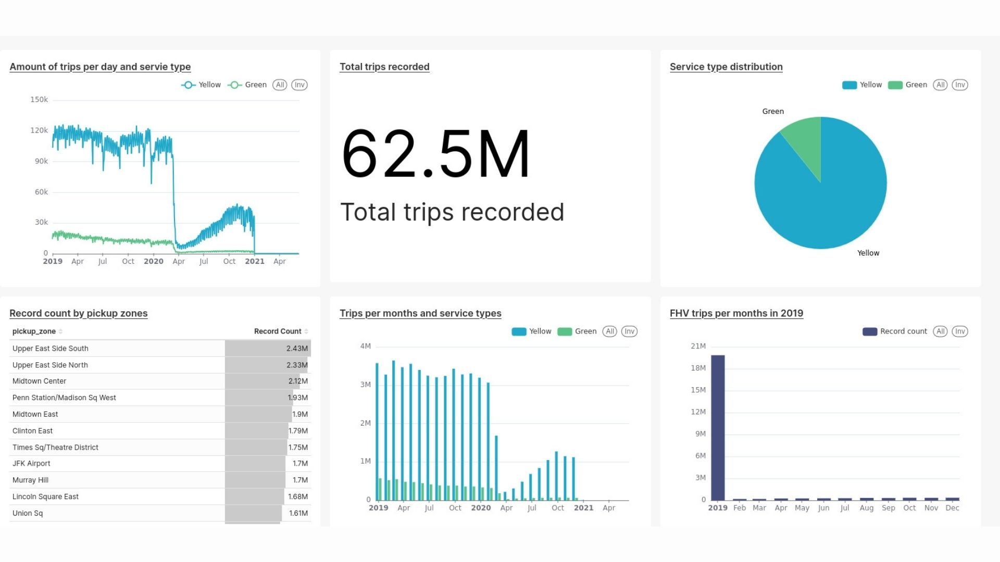

### Week 4 - homework
1. What happens when we execute dbt build --vars '{'is_test_run':'true'}' ?
* answer : It applies a limit 100 to all of our models

2. Code for the CI job
* The code from a development branch requesting a merge to main

3. What is the count of records in the model fact_fhv_trips after running all dependencies with the test run variable disabled (:false)?



-- script for the staging area
```
with tripdata as (

    select * 
    from {{ source('staging', 'external_fhv_tripdata_all') }}
    where dispatching_base_num is not null 
    AND EXTRACT(YEAR FROM pickup_datetime) = 2019
)
```
-- answer : 22998722

4. What is the service that had the most rides during the month of July 2019 month with the biggest amount of rides after building a tile for the fact_fhv_trips table?
-- answer : Yellow

