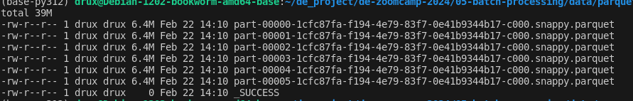

### Week 5 - Batch processing | homework
We put what we learned about Spark in practice with this homework.

#### Question 1 - out from executing spark.version

```
spark = SparkSession.builder \
    .master("local[*]") \
    .appName('homework') \
    .getOrCreate()

print(spark.version)
```

&rarr; answer : 3.4.2

#### Question 2 - FHV Ocotber 2019
What is the average size of the Parquet (ending with .parquet extension) Files that were created (in MB)? Select the answer which most closely matches.



&rarr; answer : 6MB

#### Question 3 - count records
How many taxi trips were there on the 15th of October? 
**Tips**: Consider only trips that started on the 15th of October. 

```
spark = SparkSession.builder \
    .master("local[*]") \
    .appName('homework') \
    .getOrCreate()

df_fhv = spark.read.parquet('../data/parquet/fhv/*')
df_fhv.registerTempTable('fhv_data')

spark.sql("""
        select 
            count(1)
        from
            fhv_data
        where 
            cast(pickup_datetime as date) = '2019-10-15'                        
        """).show()

```

&rarr; answer :

```
+--------+
|count(1)|
+--------+
|   62610|
+--------+
```

#### Question 4 - Longest trip for each day

What is the length of the longest trip in the dataset in hours?

```
spark.sql("""
            select 
                pickup_datetime,
                dropoff_datetime,
                datediff(hour, pickup_datetime, dropoff_datetime) as longest_trip_in_hour
            from
                fhv_data
            order by 3 desc
            limit 10                    
            """).show()
```

Result of the query :
```
+-------------------+-------------------+--------------------+
|    pickup_datetime|   dropoff_datetime|longest_trip_in_hour|
+-------------------+-------------------+--------------------+
|2019-10-11 18:00:00|2091-10-11 18:30:00|              631152|
|2019-10-28 09:00:00|2091-10-28 09:30:00|              631152|
|2019-10-31 23:46:33|2029-11-01 00:13:00|               87672|
|2019-10-01 21:43:42|2027-10-01 21:45:23|               70128|
|2019-10-17 14:00:00|2020-10-18 00:00:00|                8794|
|2019-10-26 21:26:00|2020-10-26 21:36:00|                8784|
|2019-10-30 12:30:04|2019-12-30 13:02:08|                1464|
|2019-10-25 07:04:57|2019-12-08 07:21:11|                1056|
|2019-10-25 07:04:57|2019-12-08 07:54:33|                1056|
|2019-10-01 13:41:00|2019-11-03 14:58:51|                 793|
+-------------------+-------------------+--------------------+
```

&rarr; answer : 631,152.50 Hours


#### Question 5 - User Interface
&rarr; answer : 4040

#### Question 6 - Least frequent pickup location zone
Load the zone lookup data into a temp view in Spark.
```
## Loading zones
schema_zones = types.StructType([
                    types.StructField('locationid', types.IntegerType(), True), 
                    types.StructField('borough', types.StringType(), True), 
                    types.StructField('zone', types.StringType(), True), 
                    types.StructField('service_zone', types.StringType(), True)
                    ])
df_zones = spark.read \
    .option("header", "true") \
    .schema(schema_zones) \
    .csv('../data/taxi_zone_lookup.csv')
df_zones.registerTempTable('zones_data')
```

Using the zone lookup data and the FHV October 2019 data, what is the name of the LEAST frequent pickup location Zone?
```
 spark.sql("""
            select 
                z1.zone as pickup_zone,
                count(1) as nb_pickups
            from
                fhv_data fhv
            join zones_data z1 on z1.locationid = fhv.PULocationID
            join zones_data z2 on z2.locationid = fhv.DOLocationID
            group by 1
            order by 2 asc
            limit 10                    
            """).show()
```

* result :

```
+--------------------+----------+                                               
|         pickup_zone|nb_pickups|
+--------------------+----------+
|         Jamaica Bay|         1|
|Governor's Island...|         2|
| Green-Wood Cemetery|         5|
|       Broad Channel|         8|
|     Highbridge Park|        14|
|        Battery Park|        15|
|Saint Michaels Ce...|        23|
|Breezy Point/Fort...|        25|
|Marine Park/Floyd...|        26|
|        Astoria Park|        29|
+--------------------+----------+
```

&rarr; answer : Jamaica Bay