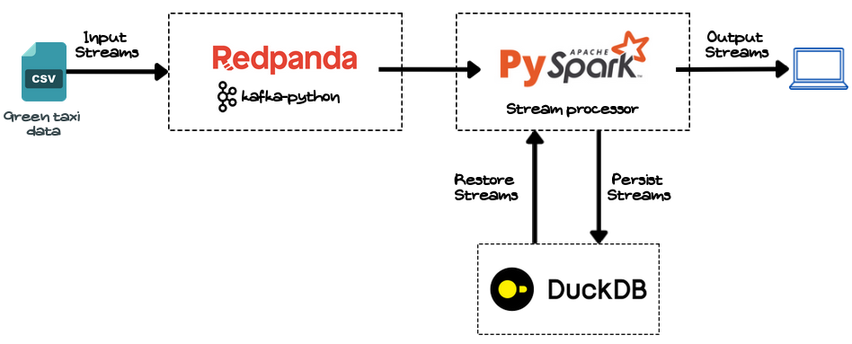

## Stream processing

Stream processing can be compared to real time information exchange. Someone produces an inforation, and there are consumers who will access the information in real time.
In the domain of data processing, Real time means refers to a matter of minutes for the consumption of the data once it has been produced.

### Tools for stream processing
There are several tools for stream processing, such as Apache Flink, Spark, **Kafka** or even Google Dataflow. The focus of this week will be Kafka, we will see all the details and the internals of the tool and learn how we can implement a stream pipeline.

### Kafka 
Apache Kafka is an open-source software, designed to build distributed event streaming platform for high-performance data pipelines, streaming analytics, data integration or mission critical application.
Kafka is pretty popular for its flexibility, robustness and reliability.

A kafka cluster is a node of machines talking to each others.

More info about Kafka here : https://kafka.apache.org/intro

### Homework

