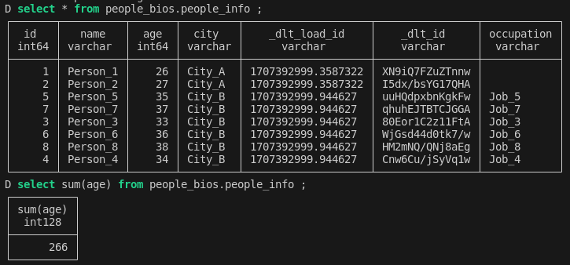

### Homework for DLT

#### question 1
What is the sum of the outputs of the generator for limit = 5?
```
def square_root_generator(limit):
    n = 1
    while n <= limit:
        yield n ** 0.5
        n += 1

if __name__ == "__main__":
    limit = 5 
    sum_sqrt = 0
    for sqrt_value in square_root_generator(limit):
        print(sqrt_value)
        sum_sqrt += sqrt_value
    print(sum_sqrt)
```
* answer: 8.382332347441762

#### question 2
What is the 13th number yielded by the generator?
```
if __name__ == "__main__":
    limit = 14 
    sum_sqrt = 0
    idx = 1
    for sqrt_value in square_root_generator(limit):
        print(idx, sqrt_value)
        sum_sqrt += sqrt_value
        idx += 1
    print(sum_sqrt)
```
* answer: 3.605551275463989

#### question 3
Append the 2 generators. After correctly appending the data, calculate the sum of all ages of people.
```
def people_1():
    for i in range(1, 6):
        yield {"ID": i, "Name": f"Person_{i}", "Age": 25 + i, "City": "City_A"}

def people_2():
    for i in range(3, 9):
        yield {"ID": i, "Name": f"Person_{i}", "Age": 30 + i, "City": "City_B", "Occupation": f"Job_{i}"}


if __name__ == "__main__":
    
    people = []
    for person in people_1():
        print(person)  
        people.append(person)

    for person in people_2():
        print(person)
        people.append(person)

    print(people)
    print(sum(p['Age'] for p in people))
```
* answer : 353

#### question 4
Merge the 2 generators using the ID column. Calculate the sum of ages of all the people loaded as described above.
```
    pipeline = dlt.pipeline(pipeline_name="people_infos",
                            destination='duckdb',
                            dataset_name='people_bios')
    print('inserting the first generator')
    people = []
    for person in people_1():
        people.append(person)
    info = pipeline.run(people,
                        table_name ="people_info",
                        write_disposition="replace")
    
    print(info, '\n')
    print('inserting the second generator')

    people = []
    for person in people_2():
        people.append(person)
    info = pipeline.run(people,
                        table_name ="people_info",
                        primary_key="id",
                        write_disposition="merge")
    print(info)
```
* answer: 266

